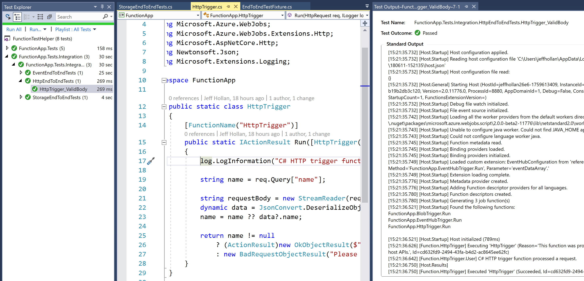

# Azure Functions Test Fixture

🚧 This is a community driven proof of concept 🚧

Test Azure Functions - not only with unit tests, but with integration tests executing the function as part of the host.  The project contains 4 parts:

|Project Folder|Description|
|--|--|
|FunctionApp|A Function App with triggers for HTTP, Blob, and Event Hubs|
|FunctionApp.Tests|Unit tests for each of the Azure Functions|
|FunctionApp.Tests.Integration|End-to-end integration tests that run the functions host and coordinate tests across the Azure Functions|
|FunctionTestHelper|A helper project that includes methods for test running and generation|

The test methods used are pulled from the [azure-functions-host](https://github.com/Azure/azure-functions-host/tree/dev/test/WebJobs.Script.Tests.Integration) integration tests, and this [Azure Sample](https://github.com/Azure-Samples/functions-unittesting-sample)

Currently the project is only tested in Visual Studio 2017 for C# projects.  However, you can follow some of the integration tests in the [azure-functions-host](https://github.com/Azure/azure-functions-host/tree/dev/test/WebJobs.Script.Tests.Integration/WebHostEndToEnd) project to see how other languages could be executed.

## Setup

**Pre-requisites**: Azure Functions tooling installed in Visual Studio 2017

1. Clone this repo: `git clone https://github.com/jeffhollan/functions-test-helper`
1. Open the solution in Visual Studio 2017
1. Add the [Azure App Services myGet feed](https://myget.org/gallery/azure-appservice) to NuGet: `https://www.myget.org/F/azure-appservice/api/v3/index.json`
    * This is used to pull the Azure Functions WebHost outside of the core tools
1. Build the solution
1. Add a folder for the webhost language workers
    There are some manual steps that are required.  Specifically during execution the function WebHost will attempt to discover the language workers for Node and Java which are not included in the default worker directory "workers."  Unfortunately, the webhost will look in a relative path for a folder called "workers."  To work around this, open up the path where the NuGet package was restored. On Windows this is usually:

    `C:\Users\{username}\.nuget\packages\microsoft.azure.webjobs.script\2.0.0-{version}\lib\netstandard2.0`

    And create an empty folder called `workers`.  If you want to run the language workers in the tests you will need to copy a valid workers folder from the core tools or other directory.  
1. Provide the correct `local.settings.json` file in the `FunctionApp` project.
    * There is a sample provided.  Just replace the placeholders with valid keys from an Azure Subscription.  For the resources, the current code assumes:
        - The name of the Event Hub in the namespace is `test`
        - There is a container in the storage account called `test`
1. Run the `FunctionApp` project to make sure everything is installed correctly
1. Run all tests in the solution (using the Visual Studio test explorer)

You can also view the outputs of any integration test.  It will contain all logs from the host during the duration of the test.

## Updating the Azure Functions Host version

Currently the project is set to the current public release of the Azure Functions runtime.  As updates to the runtime occur, it would be your responsibility to also update the version of the WebHost NuGet package in the `FunctionTestHelper` project.  You can see the number for each release and its status on [GitHub here](https://github.com/Azure/azure-functions-host/releases).

> NOTE: At the time of publishing it this is an especially interesting time as the gap between the current Visual Studio tools and the current host runtime also transitions between .NET Core 2.0 and .NET Core 2.1, with some significant changes into dependency loading into the web host.  Currently I have the .NET Core 2.0 webhost as part of the project and plan to revisit in the coming weeks to update to the current train of .NET Core 2.1